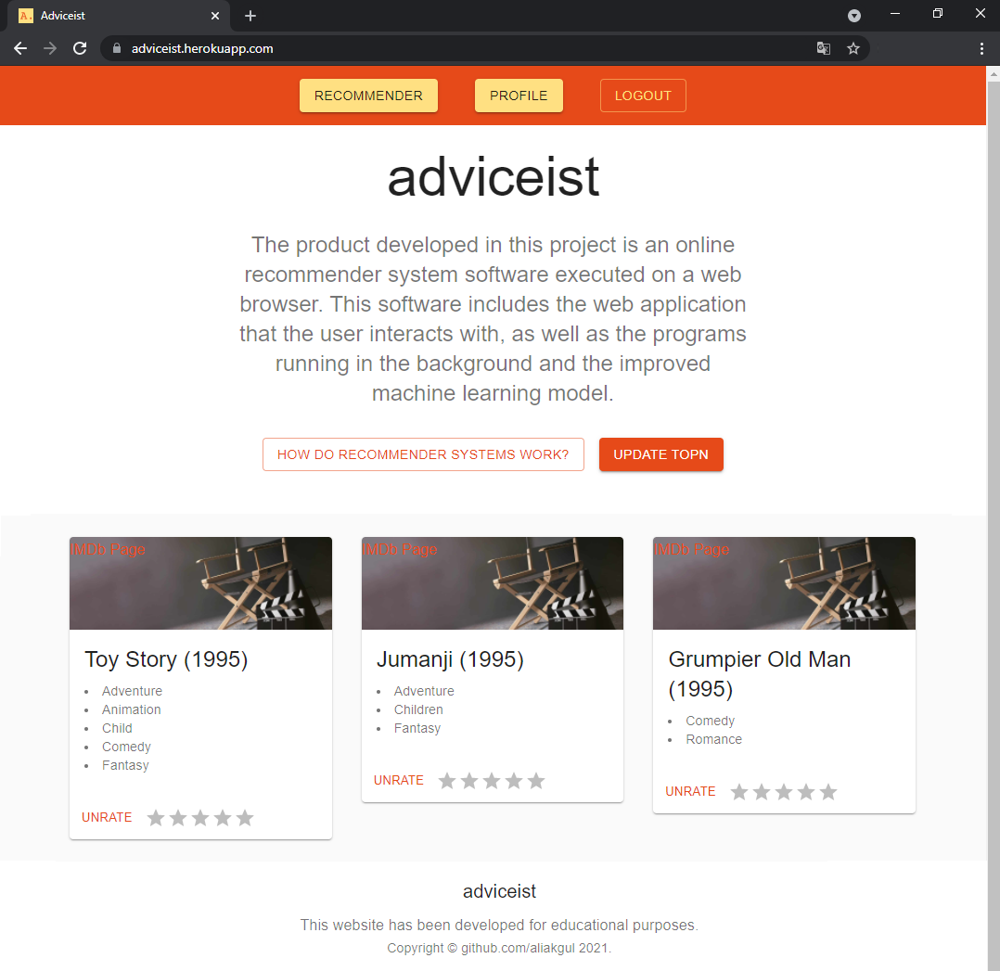

# Adviceist: An Application of Recommender Systems

> ❗ **Machine Learning Module has not been implemented yet.**

Heroku: [adviceist.herokuapp.com](https://adviceist.herokuapp.com)
GitHub: [github.com/aliakgul/adviceist](https://github.com/aliakgul/adviceist)

    adviceist
        ├── backend             # nodejs, express, mongodb, mongoose
        ├── frontend            # reactjs, material-ui
        ├── machine-learning    # tensorflow
        ├── documentation       # pdf, pptx
        └── README.md		    # herokuapp, postman, vscode, anaconda/spyder

### Resources
    https://www.udemy.com/course/react-nodejs-express-mongodb-the-mern-fullstack-guide/
    https://www.udemy.com/course/building-recommender-systems-with-machine-learning-and-ai/
    https://www.tensorflow.org/recommenders/

### Screenshots

